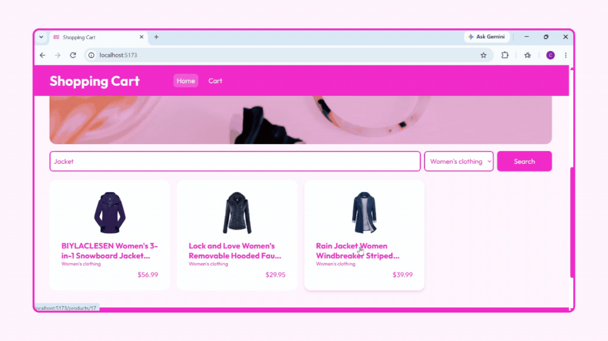

# Shopping Cart from The Odin Project (TOP) Course
This **Shopping Cart** project is built for [The Odin Project](https://www.theodinproject.com/) assignment at [Project: Shopping Cart](https://www.theodinproject.com/lessons/node-path-react-new-shopping-cart).

**Shopping Cart** project is an e-commerce front-end website with cart management.

## Table of Contents 📋
- [Installation & Setup](#installation--setup-️)
- [Features](#features-)
- [Tech Stacks](#tech-stacks-)
- [Result](#result)
 
## Installation & Setup ⚙️
> [!IMPORTANT]
> You're required to have `Node.js` to run this project

1. Clone the repository
```bash
git clone -b main https://github.com/Ca-ri-ssa/shopping-cart-top.git
```
2. Install all dependencies
```bash
npm install
```
3. Now, you can run it!
```bash
npm run dev
```

## Features ✨
- [x] Display products in Home page.
- [x] Display product details in Product Detail page.
- [x] Search products & filter by their categories.
- [x] Add product to cart in its Product Detail page.
- [x] Update or remove cart item by its product in Product Detail page.
- [x] Remove cart item in Cart page.

## Tech Stacks 🔨
|         Layer        |   Technology   |
| :------------------- | :------------- |
|     **Front-End**    |   Vite, React  |
| **State Management** |   Context API  |
|     **Back-End**     | Fake Store API (https://fakestoreapi.com) |
|     **Database**     | Local Storage  |

## Result
Shopping Cart allows users to search product and filter it by its category in `Home` page.


The detail of the product can be viewed by clicking on any product card. From the `Product Detail` page, users can also add product directly to cart.



On the `Cart` page, users can view a summary of all cart items (total item count & subtotal). User can also remove cart items directly from this page.


Users can also instantly remove product from their cart on the `Product Detail` page.

